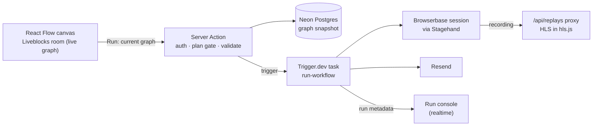

# Autodew


[](https://autodew.vercel.app)

A visual, multiplayer workflow builder for AI-driven browser automation. Users compose a graph of steps on a shared canvas — open a page, act on it, extract data, observe the DOM, hand control to an autonomous agent, send an email — and the workflow runs as a durable background job against a cloud browser, with each step's status streaming back to the UI.

> [!NOTE]
> A learning project. It started from a Code with Antonio course project, and I used it to practise three things: durable background jobs (Trigger.dev), putting AI agents inside a product (Stagehand's `act` / `extract` / `observe` / `agent` exposed as workflow nodes), and working with AI coding agents (the repo carries agent rules and skills: `CLAUDE.md`, `AGENTS.md`, `.agents/skills`). The 37 commits span August 7–9, 2026.

## What you can build with it

A workflow is a directed graph with one Start node. Steps are described in plain language and resolved by the browser-automation engine at run time, so the same graph does not depend on CSS selectors.

- **Open URL → Extract → Send Email** — open a product page, extract its price, email the result. The email body references the Extract step with a token like `{{ <nodeId>.extraction }}`.
- **Open URL → Act → Observe** — click through a page, then check what the page shows.
- **Open URL → Agent** — hand an open-ended instruction to an autonomous agent (Pro plan).

Runs are started manually with the Run button; Start is the only trigger.

## How a run works



1. **Edit.** The canvas state (nodes, edges, field values) lives in a Liveblocks room keyed by the workflow id. Nothing is written to Postgres while people edit.
2. **Run.** The Run button sends the current graph to a Server Action, which checks the active organization, blocks the Agent node unless the org is on the Pro plan, validates the graph, and saves it to Postgres as the canonical snapshot. It then triggers the `run-workflow` task, tagged `workflow:<id>`.
3. **Execute.** The task loads the snapshot, keeps only nodes that touch an edge, and topologically sorts them. Before each step it resolves `{{ nodeId.path }}` placeholders from upstream outputs, then runs the step's executor. One Browserbase session is opened on the first browser step and reused by every later one, so the whole run is a single recording.
4. **Watch.** After every state change the task publishes the full step list (status, duration, output or error) to the run's metadata. The page mints a read-only public token scoped to the workflow's tag and subscribes with `useRealtimeRunsWithTag`, so the console updates without polling.
5. **Replay.** A finished run returns its Browserbase session id. The replay panel fetches the recording through `/api/replays/[sessionId]`, which proxies only the HLS manifest so the Browserbase API key never reaches the browser (Pro plan).

## Key decisions

- **Live graph in Liveblocks, canonical snapshot in Postgres on Run** ([features/workflows/actions.ts](features/workflows/actions.ts), [lib/db/schema.ts](lib/db/schema.ts)) — concurrent edits merge inside the Liveblocks room without custom sync code, and Postgres is only written when someone runs the workflow. The snapshot is a single `jsonb` column shaped like React Flow's own nodes and edges. Trade-off: two copies of the graph, and the server has to treat the client-sent graph as input to validate, which is why the write goes through `validateGraph` and is scoped by `orgId`.
- **Runs are Trigger.dev tasks, not request handlers** ([features/workflows/tasks/run-workflow.ts](features/workflows/tasks/run-workflow.ts), [trigger.config.ts](trigger.config.ts)) — a run can outlive an HTTP request and the browser tab. The config sets 3 attempts with exponential backoff and a 3600 s maximum duration, and progress goes out through run metadata instead of a separate pub/sub layer. Trade-off: one more service to run, and metadata needs explicit flushing — the task flushes before a step is marked `running` and before it throws on failure, otherwise the UI never sees those states.
- **Validate and order the graph before running** ([features/workflows/lib/validate-graph.ts](features/workflows/lib/validate-graph.ts)) — `validateGraph` is a pure function (exactly one Start trigger, at least one edge, no cycle), so the client can pre-flight the graph it holds and the server reuses the same function as its save-time check. Orphaned nodes are skipped at run time rather than rejected.
- **Step outputs are referenced by template and resolved at run time** ([features/workflows/lib/interpolate.ts](features/workflows/lib/interpolate.ts), [features/workflows/hooks/use-upstream-connections.ts](features/workflows/hooks/use-upstream-connections.ts)) — a step's result is not known until it has run, so fields hold `{{ nodeId.path }}` tokens that are substituted just before the step executes. A missing path becomes an empty string and an object becomes its JSON. In the editor, `useUpstreamConnections` lists every ancestor's declared outputs, so tokens are inserted from a picker rather than typed.
- **Node types as a manifest plus a typed executor map** ([features/workflows/nodes/node-registry.ts](features/workflows/nodes/node-registry.ts), [features/workflows/nodes/node-executors.ts](features/workflows/nodes/node-executors.ts)) — each node's fields, declared outputs and icon live in one registry, and executors are a `satisfies Record<ActionNodeType, NodeExecutor>` map, so adding an action node without an executor fails type-checking.
- **Plan gating enforced on the server** ([features/workflows/actions.ts](features/workflows/actions.ts), [route.ts](<app/api/replays/[sessionId]/route.ts>)) — the Agent node and session replay require the Pro organization plan, and both checks (`has({ plan: 'pro' })`) run in the Server Action and the API route. The Trigger.dev task has no auth context, and a UI-only check can be bypassed by calling the endpoint directly.

## Stack

| Layer | Technology | Role in this project |
|---|---|---|
| Framework | Next.js 16 (App Router), React 19, TypeScript | Editor pages, Server Actions (create, delete, run, cancel), API routes |
| Canvas | `@xyflow/react` (React Flow) | Node and edge graph |
| Collaboration | Liveblocks (`@liveblocks/react-flow`) | Shared graph, live cursors, avatar stack |
| Background jobs | Trigger.dev v4 | `run-workflow` task, retries, realtime run metadata |
| Browser automation | Stagehand v3, Browserbase | `act` / `extract` / `observe` / `agent` against a cloud browser; session recording |
| Auth and billing | Clerk (Organizations, Billing) | Org-scoped workflows, Pro plan gating |
| Database | Neon Postgres, Drizzle ORM | `workflows` table, graph as `jsonb` |
| Email | Resend | Send Email node |
| Monitoring | Sentry | App errors and structured logs; every task failure forwarded by a global `tasks.onFailure` hook; source maps uploaded at build and deploy |
| Replay playback | hls.js | Plays Browserbase HLS recordings |
| UI | Tailwind CSS v4, shadcn/ui | Components |

## What this project was for

- **Durable execution** — modelling long-running work as Trigger.dev tasks with retries and realtime metadata instead of async route handlers.
- **Agents inside a product** — Stagehand's four primitives exposed as workflow nodes, plus a Pro-gated autonomous Agent node.
- **Realtime collaboration** — a Liveblocks room per workflow, private by default and opened only to the owning organization.
- **Multi-tenant plumbing** — Clerk Organizations and Billing, with every workflow query scoped by `orgId` and plan checks made on the server.
- **Working with coding agents** — project rules and skills committed to the repo so an agent picks up its conventions (for example, `AGENTS.md` says to derive database types from the Drizzle schema).

## Run locally

Needs accounts for Clerk (Organizations enabled, plus an organization plan with the slug `pro` in Billing), Neon, Liveblocks, Trigger.dev, Browserbase and Resend.

```bash
npm install
npm run db:migrate      # uses DATABASE_URL_UNPOOLED from .env.local
npm run dev             # http://localhost:3000

# in a second terminal — runs only execute while the dev worker is up
npx trigger.dev dev
```

`trigger.config.ts` still points at the original Trigger.dev project ref (and `next.config.ts` at the original Sentry org and project); replace them with your own.

<details>
<summary>Environment variables (.env.local)</summary>

| Key | Purpose |
|---|---|
| `DATABASE_URL` | Pooled Neon connection used by the app (HTTP driver) |
| `DATABASE_URL_UNPOOLED` | Direct connection used by `drizzle-kit` migrations |
| `NEXT_PUBLIC_CLERK_PUBLISHABLE_KEY`, `CLERK_SECRET_KEY` | Clerk |
| `TRIGGER_SECRET_KEY` | Trigger.dev (read by the SDK) |
| `LIVEBLOCKS_SECRET_KEY` | Liveblocks server client (room creation, user identification) |
| `BROWSERBASE_API_KEY` | Browserbase sessions and replays. Model calls go through Browserbase's model gateway, so no separate model key is needed |
| `RESEND_API_KEY` | Send Email node |
| `SENTRY_DSN`, `NEXT_PUBLIC_SENTRY_DSN`, `SENTRY_AUTH_TOKEN` | Error reporting and source-map upload |

Clerk's sign-in and sign-up URL variables (`NEXT_PUBLIC_CLERK_SIGN_IN_URL` and friends) are optional routing config for the `(auth)` routes. No `.env.example` is committed — TODO for me to add one.

Other scripts: `npm run build`, `npm run start`, `npm run lint`, `npm run typecheck`, `npm run format`, `npm run db:generate`, `npm run db:studio`.

</details>

## Project structure

```
.
├── app/
│   ├── (auth)/                  # Clerk sign-in, sign-up, organization picker
│   ├── (dashboard)/             # Workflow list, editor (workflows/[id]), billing
│   └── api/                     # liveblocks/auth, liveblocks/users, replays/[sessionId]
├── features/workflows/
│   ├── actions.ts               # Server Actions: create, delete, run, cancel
│   ├── data.ts                  # Org-scoped Postgres reads and writes
│   ├── components/              # Canvas, inspector, run console, logs, session replay
│   ├── nodes/                   # Node registry and one executor per node type
│   ├── tasks/run-workflow.ts    # The Trigger.dev task
│   └── lib/                     # validate-graph, interpolate
├── lib/                         # Drizzle + Neon, Liveblocks, Browserbase, Resend clients
├── drizzle/                     # Generated SQL migrations
├── .agents/, .claude/           # Agent skills used while building
└── CLAUDE.md, AGENTS.md         # Rules for coding agents working in this repo
```

## Tests and status

There are no automated tests; `validateGraph` and `interpolate` are pure functions and the obvious first candidates. `npm run typecheck` and `npm run build` pass. Send Email sends from Resend's sandbox address (`onboarding@resend.dev`). The app is deployed on Vercel (Trigger.dev tasks run on Trigger.dev's cloud). Sign-up is required, and authentication runs on a Clerk development instance. The Agent node and session replay need the Pro plan on the signed-in organization; running it yourself requires the accounts listed above.

## License

No license file is included. Personal learning project — shown here for portfolio purposes.
