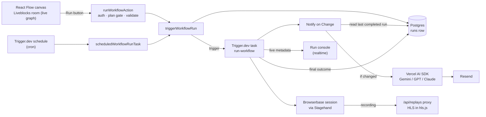

# Autodew


[](https://autodew.vercel.app)

A visual, multiplayer workflow builder for AI-driven browser automation. Users compose a graph of steps on a shared canvas — open a page, act on it, extract data, observe the DOM, hand control to an autonomous agent — and the workflow runs as a durable background job against a cloud browser, with each step's status streaming back to the UI. Runs can be triggered by hand, on a schedule, or watched for change: a Notify on Change node compares a run's output to the last completed run and only emails when something actually changed, with an AI-written summary of what.

> [!NOTE]
> A learning project. It started from a Code with Antonio course project (durable background jobs with Trigger.dev, AI agents via Stagehand's `act` / `extract` / `observe` / `agent`), and I've since extended it substantially on my own: persisted run history, cron scheduling, a change-detection/notification node with a choice of AI provider, a public landing page, and a first pass at test coverage. 50 commits span August 7 – September 2026.

## What you can build with it

A workflow is a directed graph with one Start node. Steps are described in plain language and resolved by the browser-automation engine at run time, so the same graph does not depend on CSS selectors.

- **Open URL → Extract → Send Email** — open a product page, extract its price, email the result. The email body references the Extract step with a token like `{{ <nodeId>.extraction }}`.
- **Open URL → Extract → Notify on Change** — the same extraction, but only emails when the value actually differs from the last completed run, with an AI-written one-line summary of the change (a price/content watcher, not just a one-shot runner).
- **Open URL → Act → Observe** — click through a page, then check what the page shows.
- **Open URL → Agent** — hand an open-ended instruction to an autonomous agent (Pro plan).

Runs start from the Run button, or automatically on a cron schedule attached to the workflow (also Pro-gated when the graph uses a premium node).

## How a run works



1. **Edit.** The canvas state (nodes, edges, field values) lives in a Liveblocks room keyed by the workflow id. Nothing is written to Postgres while people edit.
2. **Trigger.** Either the Run button or a cron schedule calls `triggerWorkflowRun`, the one place a run actually starts. A `runs` row is created first (status `running`), so a row exists even if triggering itself fails; the Trigger.dev task then gets that row's id in its payload.
3. **Execute.** The task loads the saved graph, keeps only nodes that touch an edge, and topologically sorts them. Before each step it resolves `{{ nodeId.path }}` placeholders from upstream outputs, then runs the step's executor. One Browserbase session is opened on the first browser step and reused by every later one, so the whole run is a single recording.
4. **Compare and notify.** A Notify on Change step looks up the same node's output from the last *completed* run, compares it to the current value, and — only if it differs — asks the chosen LLM provider for a one-line summary and emails it.
5. **Watch.** After every state change the task publishes the full step list (status, duration, output or error) to the run's metadata. The page mints a read-only public token scoped to the workflow's tag and subscribes with `useRealtimeRunsWithTag`, so the console updates without polling. A separate History tab reads the same outcome back from Postgres, independent of Trigger.dev's own retention.
6. **Replay.** A finished run returns its Browserbase session id. The replay panel fetches the recording through `/api/replays/[sessionId]`, which proxies only the HLS manifest so the Browserbase API key never reaches the browser (Pro plan).

## Key decisions

- **Live graph in Liveblocks, canonical snapshot in Postgres on Run** ([features/workflows/actions.ts](features/workflows/actions.ts), [lib/db/schema.ts](lib/db/schema.ts)) — concurrent edits merge inside the Liveblocks room without custom sync code, and Postgres is only written when someone runs the workflow. Trade-off: two copies of the graph, and the server has to treat the client-sent graph as input to validate, which is why the write goes through `validateGraph` and is scoped by `orgId`.
- **Runs are Trigger.dev tasks, not request handlers** ([features/workflows/tasks/run-workflow.ts](features/workflows/tasks/run-workflow.ts), [trigger.config.ts](trigger.config.ts)) — a run can outlive an HTTP request and the browser tab. The whole task body runs inside one outer try/catch, which is the single place its final outcome is written to Postgres — on the success path and on any thrown error, so `steps` still gets persisted (even as `[]`) if the run never got past loading the graph.
- **One `triggerWorkflowRun`, two callers with no shared auth context** ([features/workflows/runs-data.ts](features/workflows/runs-data.ts)) — the Run button's Server Action has a Clerk session to check plan and ownership; the scheduled task, firing on Trigger.dev's own clock, has none. Both funnel into the same function to actually create the run row and trigger the task, so the mechanics of starting a run live in one place while each caller enforces its own auth.
- **Schedules attach to one static task via `externalId`** ([features/workflows/tasks/scheduled-workflow-run.ts](features/workflows/tasks/scheduled-workflow-run.ts)) — rather than a schedule task per workflow, a single `schedules.task` reads `payload.externalId` (the workflow id) to know what to run, and `deduplicationKey` reuses that same id so re-saving a schedule updates it instead of creating a second one.
- **Change detection compares a node's own past output, not a generic diff** ([features/workflows/nodes/notify-on-change.ts](features/workflows/nodes/notify-on-change.ts), [lib/compare-value.ts](features/workflows/lib/compare-value.ts)) — Notify on Change looks up the last completed run, finds the step with its own node id, and reads that step's previous `value`. The comparison itself is a small pure function with three outcomes (`first-observation` / `unchanged` / `changed`), tested in isolation without touching the database.
- **The AI provider is a per-node choice, not a hard-coded model** ([features/workflows/nodes/notify-on-change.ts](features/workflows/nodes/notify-on-change.ts)) — a `provider` field lets each Notify on Change node pick Google, OpenAI, or Anthropic through the Vercel AI SDK at run time. The prompt itself is a pure function ([lib/change-summary-prompt.ts](features/workflows/lib/change-summary-prompt.ts)), so its wording is tested without a live API call.
- **Validate and order the graph before running** ([features/workflows/lib/validate-graph.ts](features/workflows/lib/validate-graph.ts)) — `validateGraph` is a pure function (exactly one Start trigger, at least one edge, no cycle), so the client can pre-flight the graph it holds and the server reuses the same function as its save-time check.
- **Step outputs are referenced by template and resolved at run time** ([features/workflows/lib/interpolate.ts](features/workflows/lib/interpolate.ts)) — a step's result is not known until it has run, so fields hold `{{ nodeId.path }}` tokens substituted just before execution. A missing path becomes an empty string; `0` and `false` don't, which is deliberate and covered by a test.
- **Node types as a manifest plus a typed executor map** ([features/workflows/nodes/node-registry.ts](features/workflows/nodes/node-registry.ts), [features/workflows/nodes/node-executors.ts](features/workflows/nodes/node-executors.ts)) — each node's fields, declared outputs and icon live in one registry, and executors are a `satisfies Record<ActionNodeType, NodeExecutor>` map, so adding an action node without an executor fails type-checking.
- **Premium nodes as one shared Set** ([features/workflows/lib/premium-nodes.ts](features/workflows/lib/premium-nodes.ts)) — the Agent and Notify on Change nodes both require the Pro plan; a single `premiumNodeTypes` Set drives the Toolbar's lock icon, the Run action's gate, and the schedule action's gate, so a fourth premium node is a one-line change instead of three.

## Stack

| Layer | Technology | Role in this project |
|---|---|---|
| Framework | Next.js 16 (App Router), React 19, TypeScript | Editor pages, Server Actions, API routes, public landing page |
| Canvas | `@xyflow/react` (React Flow) | Node and edge graph |
| Collaboration | Liveblocks (`@liveblocks/react-flow`) | Shared graph, live cursors, avatar stack |
| Background jobs | Trigger.dev v4 | `run-workflow` task, retries, realtime metadata, cron schedules |
| Browser automation | Stagehand v3, Browserbase | `act` / `extract` / `observe` / `agent` against a cloud browser; session recording |
| AI summaries | Vercel AI SDK (`@ai-sdk/google`, `@ai-sdk/openai`, `@ai-sdk/anthropic`) | Notify on Change writes a plain-English summary of what changed, provider chosen per node |
| Auth and billing | Clerk (Organizations, Billing) | Org-scoped workflows, Pro plan gating |
| Database | Neon Postgres, Drizzle ORM | `workflows` and `runs` tables |
| Email | Resend | Send Email and Notify on Change nodes |
| Testing | Vitest | 25 tests on the pure logic: graph validation, interpolation, schedule presets, change comparison, prompt building |
| Monitoring | Sentry | App errors and structured logs; every task failure forwarded by a global `tasks.onFailure` hook |
| Replay playback | hls.js | Plays Browserbase HLS recordings |
| UI | Tailwind CSS v4, shadcn/ui | Components |

## What this project was for

- **Durable execution** — modelling long-running work as Trigger.dev tasks with retries and realtime metadata instead of async route handlers.
- **Agents inside a product** — Stagehand's four primitives exposed as workflow nodes, plus a Pro-gated autonomous Agent node.
- **Monitoring, not just running** — Notify on Change turns a one-shot automation into a change-detection tool: compare to the last run, only act when something's different, and explain the difference in plain English.
- **Scheduling** — background jobs that fire on a timer instead of only on click, sharing the same trigger path as a manual run.
- **A first attempt at test discipline** — starting from zero tests, picking the pure functions first (no mocking needed), and writing the test for new logic (the change-comparison function) as part of building it, not after.
- **Realtime collaboration** — a Liveblocks room per workflow, private by default and opened only to the owning organization.
- **Multi-tenant plumbing** — Clerk Organizations and Billing, with every workflow query scoped by `orgId` and plan checks made on the server.

## Run locally

Needs accounts for Clerk (Organizations enabled, plus an organization plan with the slug `pro` in Billing), Neon, Liveblocks, Trigger.dev, Browserbase, Resend, and at least one of Google AI Studio / OpenAI / Anthropic for the Notify on Change node.

```bash
npm install
npm run db:migrate      # uses DATABASE_URL_UNPOOLED from .env.local
npm test                # 25 Vitest tests, no external services needed
npm run dev             # http://localhost:3000

# in a second terminal — scheduled and manual runs both need the dev worker up
npx trigger dev
```

`trigger.config.ts` still points at the original Trigger.dev project ref (and `next.config.ts` at the original Sentry org and project); replace them with your own.

<details>
<summary>Environment variables (.env.local)</summary>

| Key | Purpose |
|---|---|
| `DATABASE_URL` | Pooled Neon connection used by the app (HTTP driver) |
| `DATABASE_URL_UNPOOLED` | Direct connection used by `drizzle-kit` migrations |
| `NEXT_PUBLIC_CLERK_PUBLISHABLE_KEY`, `CLERK_SECRET_KEY` | Clerk |
| `TRIGGER_SECRET_KEY` | Trigger.dev (read by the SDK) |
| `LIVEBLOCKS_SECRET_KEY` | Liveblocks server client (room creation, user identification) |
| `BROWSERBASE_API_KEY` | Browserbase sessions and replays for Stagehand's `act`/`extract`/`observe`/`agent` |
| `GOOGLE_GENERATIVE_AI_API_KEY`, `OPENAI_API_KEY`, `ANTHROPIC_API_KEY` | Notify on Change's AI summary — only the provider selected on the node needs a working key |
| `RESEND_API_KEY` | Send Email and Notify on Change nodes |
| `SENTRY_DSN`, `NEXT_PUBLIC_SENTRY_DSN`, `SENTRY_AUTH_TOKEN` | Error reporting and source-map upload |

Clerk's sign-in and sign-up URL variables (`NEXT_PUBLIC_CLERK_SIGN_IN_URL` and friends) are optional routing config for the `(auth)` routes. No `.env.example` is committed — TODO for me to add one.

Other scripts: `npm run build`, `npm run start`, `npm run lint`, `npm run typecheck`, `npm run format`, `npm run test:watch`, `npm run db:generate`, `npm run db:studio`.

</details>

## Project structure

```
.
├── app/
│   ├── page.tsx                 # Public landing page (redirects a signed-in visitor to /workflows)
│   ├── (auth)/                  # Clerk sign-in, sign-up, organization picker
│   ├── (dashboard)/             # Workflow list, editor (workflows/[id]), billing
│   └── api/                     # liveblocks/auth, liveblocks/users, replays/[sessionId]
├── features/workflows/
│   ├── actions.ts               # Server Actions: create, delete, run, cancel, schedule
│   ├── data.ts                  # Org-scoped Postgres reads and writes for workflows
│   ├── runs-data.ts             # Run history: create/complete/list a run, triggerWorkflowRun
│   ├── components/              # Canvas, inspector, run console, History tab, Schedule dialog
│   ├── nodes/                   # Node registry and one executor per node type
│   ├── tasks/                   # run-workflow (manual/scheduled) and scheduled-workflow-run
│   └── lib/                     # validate-graph, interpolate, compare-value, schedule-presets,
│                                 # change-summary-prompt, premium-nodes (+ *.test.ts alongside each)
├── lib/                         # Drizzle + Neon, Liveblocks, Browserbase, Resend clients
├── drizzle/                     # Generated SQL migrations
├── vitest.config.ts
├── .agents/, .claude/           # Agent skills used while building
└── CLAUDE.md, AGENTS.md         # Rules for coding agents working in this repo
```

## Tests and status

25 Vitest tests across 6 files cover the pure logic: graph validation, template interpolation, slug generation, schedule presets, and change comparison / prompt building for Notify on Change. `npm run typecheck`, `npm run lint` and `npm run build` all pass. Send Email and Notify on Change send from Resend's sandbox address (`onboarding@resend.dev`). The app is deployed on Vercel (Trigger.dev tasks and schedules run on Trigger.dev's cloud). Sign-up is required, and authentication runs on a Clerk development instance. The Agent node, session replay, and Notify on Change all need the Pro plan on the signed-in organization; running it yourself requires the accounts listed above.

## License

No license file is included. Personal learning project — shown here for portfolio purposes.
